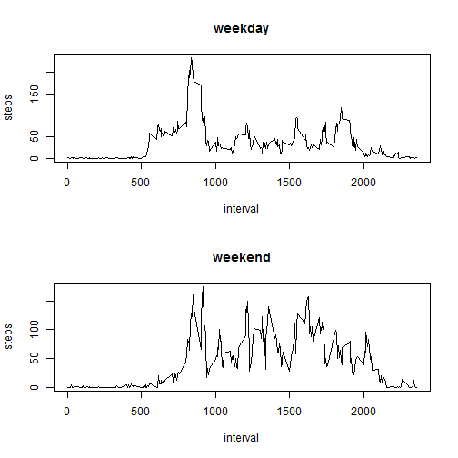

## Loading and preprocessing the data

1. Load the data

```r
data<-read.csv("activity.csv")
```
2. Process/transform the data (if necessary) into a format suitable for your analysis

```r
step<- aggregate(steps~date, data, sum, na.rm=TRUE)
```

## What is mean total number of steps taken per day?
1. Make a histogram of the total number of steps taken each day

```r
barplot(step$steps, names.arg=step$date, xlab = "date", ylab = "steps")
```

 
2. Calculate and report the mean and median total number of steps taken per day

```r
mean(step$steps)
```

```
## [1] 10766.19
```

```r
median(step$steps)
```

```
## [1] 10765
```

## What is the average daily activity pattern?
1. Make a time series plot (i.e. type = "l") of the 5-minute interval (x-axis) and the average number of steps taken, averaged across all days (y-axis)

```r
step1<- aggregate(steps~interval, data, mean, na.rm=TRUE)
plot(step1,type="l")
```

 
2. Which 5-minute interval, on average across all the days in the dataset, contains the maximum number of steps?

```r
step1$interval[which.max(step1$steps)]
```

```
## [1] 835
```

## Imputing missing values
1. Calculate and report the total number of missing values in the dataset (i.e. the total number of rows with NAs)

```r
library(lubridate)
sum(is.na(data$steps))
```

```
## [1] 2304
```
2. Devise a strategy for filling in all of the missing values in the dataset. 

```r
data1<-merge(data,step1,by="interval")
```
3. Create a new dataset that is equal to the original dataset but with the missing data filled in.

```r
na <- is.na(data1$steps)
```

```
## Warning in is.na(data1$steps): is.na() applied to non-(list or vector) of
## type 'NULL'
```

```r
data1$steps.x[na]<-data1$steps.y[na]
```
4. Make a histogram of the total number of steps taken each day and Calculate and report the mean and median total number of steps taken per day.

```r
step2<- aggregate(steps.x~date, data1, sum)
barplot(step2$steps.x, names.arg=step2$date, xlab = "date", ylab = "steps")
```

 

```r
mean(step2$steps.x)
```

```
## [1] 10766.19
```

```r
median(step2$steps.x)
```

```
## [1] 10765
```


## Are there differences in activity patterns between weekdays and weekends?
1. Create a new factor variable in the dataset with two levels – “weekday” and “weekend” indicating whether a given date is a weekday or weekend day.

```r
day <- function(date) {
    if (weekdays(as.Date(date)) %in% c("sabato", "domenica")) {
        "weekend"
    } else {
        "weekday"
    }
}
data1$day<-sapply(data1$date, day)
```
2. Make a panel plot containing a time series plot (i.e. type = "l") of the 5-minute interval (x-axis) and the average number of steps taken, averaged across all weekday days or weekend days (y-axis).

```r
par(mfrow = c(2, 1))
dataweekday<-subset(data1,day=="weekday")
stepweekday<- aggregate(steps.x~interval, dataweekday, mean)
plot(stepweekday,type="l",ylab = "steps",  main="weekday")
dataweekend<-subset(data1,day=="weekend")
stepweekend<- aggregate(steps.x~interval, dataweekend,mean)
plot(stepweekend,type="l",ylab = "steps",  main="weekend")
```

 
